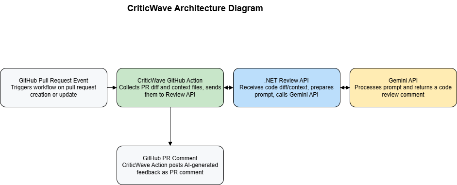

# CriticWave Action

[](https://github.com/marketplace/actions/criticwave-action)

**CriticWave Action** is a GitHub Action that analyzes your Pull Requests (PRs) using the Gemini API to provide detailed code reviews. It posts comments directly on the PR with identified issues, severity, explanations, and suggested fixes — all powered by AI.

---

## Architecture



---

## Features

- Automatically fetches PR diffs and full files changed in the PR
- Sends diff and full context files to a backend Review API powered by Gemini API
- Supports customizable style guide prompts for consistent review style
- Posts clear, actionable review comments in the PR conversation
- Supports multiple file types and highlights code snippets with syntax highlighting
- Handles large PRs by uploading all relevant files for thorough analysis

---

## Usage

### Inputs

| Name             | Description                             | Required | Default             |
|------------------|-----------------------------------------|----------|---------------------|
| `github-token`   | GitHub token to post comments           | Yes      | —                   |
| `gemini-api-key` | Your Gemini API key                     | Yes      | —                   |
| `pr-style-guide` | Style guide prompt for review           | Yes      | —                   |
| `model`          | Gemini model to use for review API      | No       | `gemini-2.0-flash`  |

---

### Example Workflow

```yaml
name: PR Review with CriticWave

on:
  pull_request:
    types: [opened, synchronize, reopened]

jobs:
  review:
    runs-on: ubuntu-latest
    steps:
      - uses: actions/checkout@v4

      - name: Run CriticWave PR Review
        uses: dprakash2101/criticwave-action@v1.0.0
        with:
          github-token: ${{ secrets.GITHUB_TOKEN }}
          gemini-api-key: ${{ secrets.GEMINI_API_KEY }}
          pr-style-guide: |
            Please review the code for best practices, readability, security, and performance.
            Follow the company style guide: https://example.com/style-guide
          model: gemini-2.0-flash
```

---

## How It Works

1. The action triggers on pull request events.
2. It fetches the PR diff and all changed files at the PR head commit.
3. It sends the diff, full changed files, style guide prompt, and other metadata to the Review API.
4. The Review API (powered by Gemini API) analyzes the code, generates a structured review response with issues and fixes.
5. The action formats the response into a Markdown comment and posts it on the PR.
6. Developers get an AI-powered code review directly within GitHub.

---

## Advanced Notes

* The action creates a temporary folder to store diff and full context files before sending.
* It supports multiple full files to improve the accuracy of reviews by providing full context.
* The style guide input allows tailoring the review tone and focus.
* You can specify the Gemini model for customized review behavior.
* The Review API URL is currently hardcoded but can be parameterized if needed.

---

## Troubleshooting

* Ensure your `gemini-api-key` is valid and has sufficient quota.
* The action only runs on pull request events.
* If the review API is slow, the action tries to "wake it up" before sending the request.
* Large PRs with many files might take longer due to file downloads and uploads.

---

## Author

**Devi Prakash**

---

## License

This project is licensed under the MIT License. See the [LICENSE](LICENSE) file for details.
